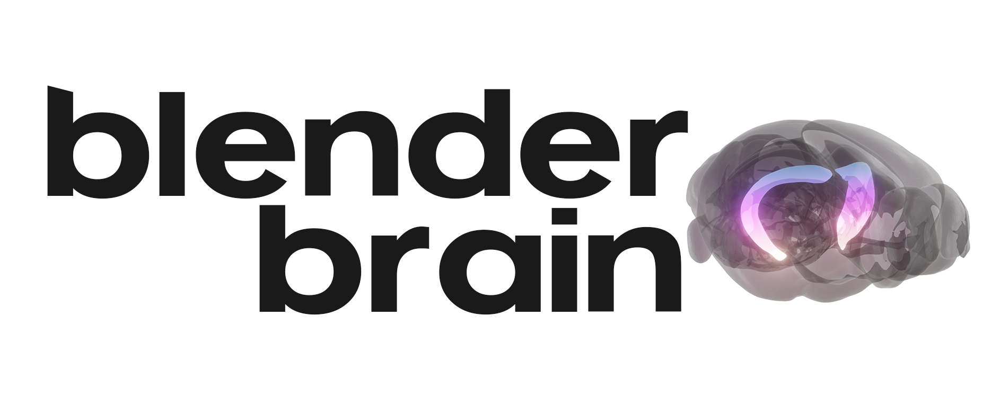

# BlenderBrain 🧠

<p align="center">
  

Easily bring 3D meshes of brain regions from atlases into Blender via [Brainglobe API](https://brainglobe.info/documentation/bg-atlasapi/index.html)


## Installation

- Install Blender 3.3 or newer: https://www.blender.org/download/ 
- Download the latest `BlenderBrain.zip` from the Releases section 
- In Blender go to Edit > Preferences... > Add-ons > Install... open the downloaded ZIP file
- Enable the addon by going to Edit > Preferences... > Add-ons and enabling "Add Mesh: BlenderBrain"


In order to use atlases, you should install them locally via [BrainGlobe](https://brainglobe.info/documentation/bg-atlasapi/index.html), eg.

```
brainglobe install -a allen_mouse_25um
```

After installing a new atlas resart Blender to see it in the dropdown


## Usage 

Select an installed atlas from the dropdown list, type in the **acronym** of the target brain structure. A list of all acronyms can be found in the `structures.csv` file, located in the atlas subfolder, created by brainglobe (usually in the home directory in a hidden `.brainglobe` folder – see [documentation](https://brainglobe.info/documentation/bg-atlasapi/usage/using-the-files-directly.html))


<video src="assets/Usage screen recording.mp4" width=1000></video>

>  **Warning**
>
> Blender can crash if you try to `Ctrl(Cmd) + Z` to undo the loading operation. So just delete the object using the outliner. 

## Licence

MIT